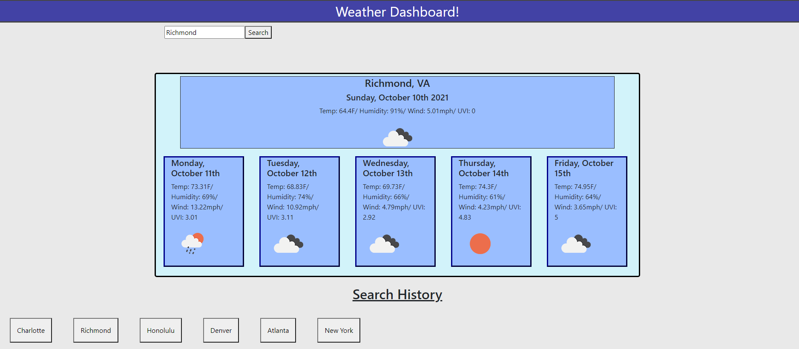

# Weather Dashboard

## Purpose
A place where you can view the forecast for the days ahead in any city! An exercize in retrieving info from server sided API's!

## Built With
* HTML
* CSS
* Bootstrap
* JavaScript
* JQuery
* Moment.js
* OpenWeatherMap API

## Website
https://zbreezie.github.io/WeatherDashboard/

## Contribution
Made with ❤️ by Zachary McCollum
